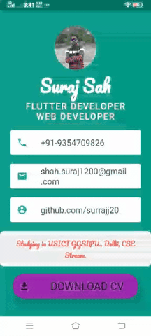

 

# My Card
Simple Business Card to show your details!

## App Demo:-

# Things to do 
- [x] Work onTap buttons, links and GesturesDetector.
- [x] Attach CV with Profile.

### APK :-
- [Click Here](https://drive.google.com/file/d/10sfpzsW7AJp8k1TnpctB7sC3h9clLIwh/view?usp=sharing) to download and run apk on your android device.
